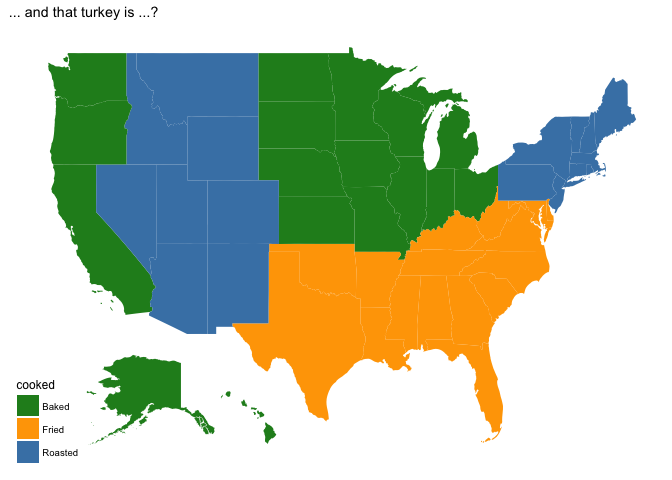

mapr
====

This R package is helping with working with maps by making insets,
pull-outs or zooms:

This map is saved as object `division` in the package.

Map of **all** US states and state equivalents as defined by the 2016
Tiger shapefiles provided by the US Census Bureau:

    data(states)
    states %>% 
      ggplot(aes(x = long, y = lat)) + geom_path(aes(group = group)) +
      ggthemes::theme_map()

The functions `scale` and `shift` allow us to scale and shift parts of
the map:

    states %>%
      shift("NAME", "Hawaii", shift_by = c(52.5, 5.5)) %>%
      scale("NAME", "Alaska", scale=0.3, set_to=c(-117, 27)) %>%
      filter(lat > 20) %>%
     ggplot(aes(long, lat)) + geom_path(aes(group=group)) +
      ggthemes::theme_map() 

This map is available as data object `inset`.

Looking for counties as well? The objects `counties` and
`counties_inset` are available in the data objects.

    counties_inset %>% ggplot(aes(x = long, y = lat)) +
      geom_path(aes(group = group), size=0.25) +
      geom_path(aes(group = group), data = inset) +
      ggthemes::theme_map() 

Sampling from a uniform distribution
====================================

Below are maps of the US overlaid by about 3200 points each. The points
are placed uniformly within the geographic region. The number of points
in each region is based on different strategies. From left to right we
have: (top-left) a sample of locations selected uniformly across the US,
(top-right) each state contains a set of 63 uniformly selected
locations, (bottom-left) each dot represents about 100k residents in
each state.

Thanksgiving traditions
=======================

In 2015 FiveThirtyEight commissioned a survey asking people across the
US a number of Thanksgiving related questions, such as side dishes,
flavor of the pie, desserts and after dinner activities. They reported
on the main difference in an article published on Nov 20 2015, available
at
.
The main finding was shown in a choropleth chart highlighting the
**disproportionally most common side dish** in each region.

The dataset with responses of more than 1000 participants is available
at:

The FiveThirtyEight chart is fun, but it doesn't show the whole picture.
What else can we find out from the data about Thanksgiving traditions?

    thanks %>% 
      filter(`How.is.the.main.dish.typically.cooked.` %in% c("Baked", "Roasted", "Fried"),
             !is.na(Division)) %>%
      ggplot(aes(x = Division, fill = `How.is.the.main.dish.typically.cooked.`)) + geom_bar(position='fill') +
        scale_fill_manual("How is the main dish\ntypically cooked", 
                          values = c("forestgreen", "orange", "steelblue")) +
      coord_flip()

This translates to a FiveThirtyEight style chart of disproportionally
most common way of preparing the main dish:

    ## Warning in left_join_impl(x, y, by$x, by$y, suffix$x, suffix$y): joining
    ## factor and character vector, coercing into character vector

Let's just use the raw data and put those on the map:

