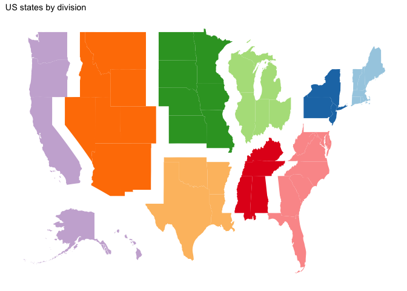

mapr
====

This R package is helping with working with maps by making insets,
pull-outs or zooms:

Map of **all** US states and state equivalents as defined by the 2016
Tiger shapefiles provided by the US Census Bureau:

    data(states01)
    states01 %>% 
      ggplot(aes(x = long, y = lat)) + geom_path(aes(group = group)) +
      ggthemes::theme_map()

The function `scale_shift` allows to scale and shift parts of the map:

    states01 %>%
      scale_shift("NAME", "Hawaii", shift = c(50, 5)) %>%
      scale_shift("NAME", "Alaska", scale=0.3, shift=c(40,-32.5)) %>%
      filter(lat > 20) %>%
     ggplot(aes(long, lat)) + geom_path(aes(group=group)) +
      ggthemes::theme_map()

