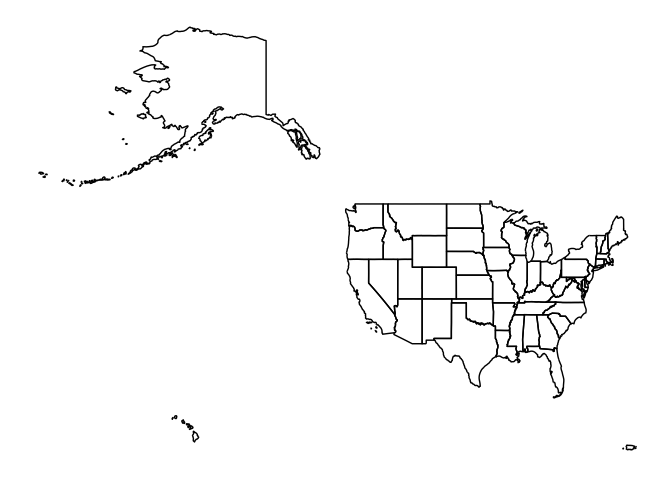
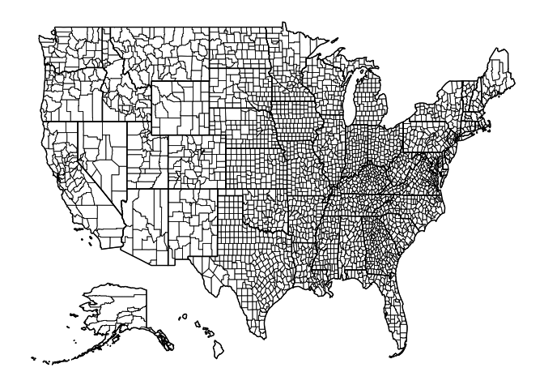

mapr
====

This R package is helping with working with maps by making insets,
pull-outs or zooms:

This map is saved as object `division` in the package.

Map of **all** US states and state equivalents as defined by the 2016
Tiger shapefiles provided by the US Census Bureau:

    data(states)
    states %>% 
      ggplot(aes(x = long, y = lat)) + geom_path(aes(group = group)) +
      ggthemes::theme_map()

The functions `scale` and `shift` allow us to scale and shift parts of
the map:

    states %>%
      shift("NAME", "Hawaii", shift_by = c(52.5, 5.5)) %>%
      scale("NAME", "Alaska", scale=0.3, set_to=c(-117, 27)) %>%
      filter(lat > 20) %>%
     ggplot(aes(long, lat)) + geom_path(aes(group=group)) +
      ggthemes::theme_map() 

This map is available as data object `inset`.

Looking for counties as well? The objects `counties` and
`counties_inset` are available in the data objects.

    counties_inset %>% ggplot(aes(x = long, y = lat)) +
      geom_path(aes(group = group), size=0.25) +
      geom_path(aes(group = group), data = inset) +
      ggthemes::theme_map() 

Sampling from a uniform distribution
====================================

Below are maps of the US overlaid by about 3200 points each. The points
are placed uniformly within the geographic region. The number of points
in each region is based on different strategies. From left to right we
have: (top-left) a sample of locations selected uniformly across the US,
(top-right) each state contains a set of 63 uniformly selected
locations, (bottom-left) each dot represents about 100k residents in
each state.

The function underlying the map based random sampling is `map_unif`.
This function takes a map (or a subset of a map) and a number `n` and
produces a dataset of `n` uniformly distributed random geo-locations
within the area specified by the map.

Thanksgiving traditions
=======================

In 2015 FiveThirtyEight commissioned a survey asking people across the
US a number of Thanksgiving related questions, such as side dishes,
flavor of the pie, desserts and after dinner activities. They reported
on the main difference in an
<a href="http://fivethirtyeight.com/features/heres-what-your-part-of-america-eats-on-thanksgiving/">article
published on Nov 20 2015</a>.

The dataset with responses of more than 1000 participants is available
from FiveThirtEight's
<a href="https://github.com/fivethirtyeight/data/blob/master/thanksgiving-2015/thanksgiving-2015-poll-data.csv">data
git hub repository</a>.

The main finding was shown in a choropleth chart highlighting the
**disproportionally most common side dish** in each region.

The FiveThirtyEight chart is fun, but it doesn't show the whole picture.
What else can we find out from the data about Thanksgiving traditions?

Looking at how participants said to prepare their turkeys we see that
the country is mostly divided between Roasting and Baking the turkey,
but some proportion of participants said that their turkey was being
fried (orange). When we look closer, we see that there is a geographical
component to where turkeys are getting fried.

For the side dishes, FiveThirtyEight styled a chart showing the
***disproportionally most common*** side dish. We have adapted the
underlying model to deal with the ***disproportionally most common***
way of preparing the main dish. This gives a nice and simple map like
this:

We see that in the South and South East turkey's are being fried
disproportionally most often, whereas everywhere else it is a toss-up
between roasting and baking the bird. But is that the whole picture ...
and what does disproprotionally most common actually mean?

Let's go back to the raw data and put those on the map:

We get a similar picture, if not quite as simple as the previous map -
but data is rarely that simple! We still see the toss-up between baking
and roasting. And it looks like the bakers of turkey are in the lead in
the North East and the Mounatin division. What we also see is the
geographical connection of the fried turkeys: the South and South East
sees more of them, but there are some friers all along the East Coast,
that we didn't see before.

Going back to the (loglinear) model of the ways turkeys are cooked by
division, we can visualize the residuals using randomly picked locations
in each of the divisions.

What we see now, is the geographical pattern from before: fried turkeys
are (disproportionally) most common in the South East, and we see the
split between baked and roasted turkey across the country - with roasted
turkey in particular most popular in New England. What we find
additionally, though, is that besides fried turkey in the South East, we
also see a liking of baked turkey that was not apparent before.
